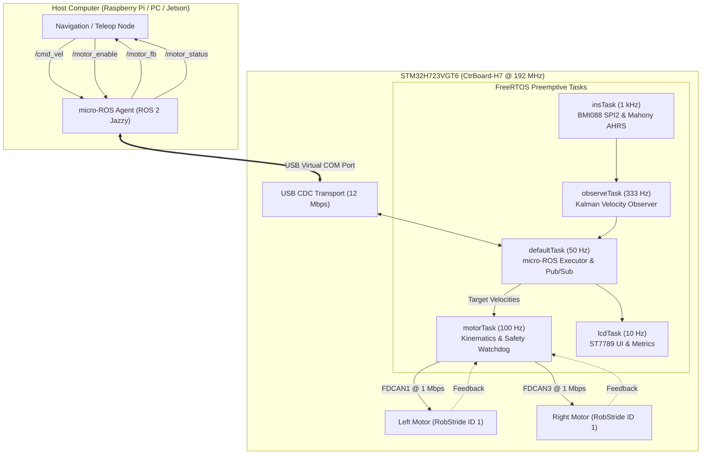

# STM32H723 micro-ROS Differential-Drive Robot Controller

[](https://opensource.org/licenses/MIT)
[](https://docs.ros.org/en/jazzy/)
[](https://www.st.com/en/microcontrollers-microprocessors/stm32h723vg.html)

[**Tiếng Việt**](README.vi.md) | **English**

High-performance embedded firmware for a differential-drive mobile robot powered by the **STM32H723VGT6** (ARM Cortex-M7 @ 192 MHz). The board acts as a native **ROS 2 Jazzy node** via **micro-ROS** over High-Speed **USB CDC Virtual COM Port (12 Mbps)**, controlling dual **RobStride / CyberGear** actuators via dual independent FDCAN buses with real-time onboard attitude estimation and diagnostic display.

---

## 🌟 Key Features

- **Native ROS 2 Jazzy Integration:** Direct DDS communication using micro-ROS over USB CDC ACM without custom bridge nodes.
- **Dual-Bus FDCAN Architecture:** Dedicated FDCAN1 (Left wheel) and FDCAN3 (Right wheel) channels running at 1 Mbps with MIT impedance control.
- **FreeRTOS Multitasking:** Preemptive real-time scheduling featuring a 1 kHz IMU task, 333 Hz Kalman velocity observer, 100 Hz motor loop, and 50 Hz ROS 2 publisher.
- **Robust Fail-Safe & Auto-Recovery:** Automatic motor cutoff on command timeout (> 500 ms), explicit motor enable handshake, and graceful DDS entity teardown/reconnect on USB disconnect.
- **Onboard Diagnostics:** Color ST7789 display (240×280 px) with live ping RTT, topic publish frequencies, and CAN bus error tracking; dedicated UART7 serial debug printout.

---

## 📐 Architecture Overview



---

## 📡 ROS 2 Interface Contract

### Topics

| Topic Name | Direction | Message Type | QoS Reliability | Rate | Description |
|---|:---:|---|---|:---:|---|
| [`/cmd_vel`](docs/topics.md#31-cmd_vel-velocity-command) | Sub | `geometry_msgs/msg/Twist` | **Best Effort** | Up to 50 Hz | Target velocity ($v_x\text{ [m/s]}$, $\omega_z\text{ [rad/s]}$) |
| [`/motor_enable`](docs/topics.md#32-motor_enable-motor-state-control) | Sub | `std_msgs/msg/Bool` | **Reliable** | On-demand | Enable (`true`) / Disable (`false`) actuators |
| [`/motor_fb`](docs/topics.md#33-motor_fb-wheel-odometry--joint-feedback) | Pub | `sensor_msgs/msg/JointState` | **Best Effort** | **50 Hz** | Position (rad), velocity (rad/s), torque (Nm) |
| [`/motor_status`](docs/topics.md#34-motor_status-status-bitmask) | Pub | `std_msgs/msg/UInt8` | **Reliable** | **5 Hz** | Health, CAN status, and timeout bitmask |

### `/motor_status` Bitmask Allocation

| Bit | Mask | Flag | Description |
|:---:|:---:|---|---|
| 0 | `0x01` | `MSTAT_LEFT_FRESH` | Left motor CAN feedback received within timeout |
| 1 | `0x02` | `MSTAT_RIGHT_FRESH` | Right motor CAN feedback received within timeout |
| 2 | `0x04` | `MSTAT_CAN1_BUSOFF` | FDCAN1 is in Bus-Off state |
| 3 | `0x08` | `MSTAT_CAN3_BUSOFF` | FDCAN3 is in Bus-Off state |
| 4 | `0x10` | `MSTAT_MOTORS_ENABLED` | Actuators are enabled and receiving power |
| 5 | `0x20` | `MSTAT_CMD_TIMEOUT` | No `/cmd_vel` received for > 500 ms |

---

## 🚀 Quickstart Guide

### 1. Build and Flash Firmware

```bash
# Clone the repository
git clone https://github.com/nguyenbinh-shark/ros_h7_usb.git
cd ros_h7_usb

# Fetch the prebuilt micro-ROS static library
./tools/fetch_libmicroros.sh

# Compile firmware
make -j$(nproc)

# Flash using STM32CubeProgrammer CLI
STM32_Programmer_CLI -c port=SWD mode=UR -w build/microros_H7.bin 0x08000000 -v -rst
```

### 2. Setup Host & Launch micro-ROS Agent

```bash
# Optional: Setup automated UDEV rules and systemd service
cd deploy/
sudo ./install_host.sh

# Or start the agent manually:
source /opt/ros/jazzy/setup.bash
ros2 run micro_ros_agent micro_ros_agent serial --dev /dev/stm32_robot
```

### 3. Keyboard Teleoperation

```bash
# Run the keyboard teleop script
python3 teleop/teleop_key.py
```
> **⚠️ Safety Note:** Motors start **DISABLED** by default. Press **`e`** in the teleop terminal to enable motors before driving with `w`/`a`/`s`/`d`.

---

## 📂 Documentation Index

Detailed guides are available in the [`docs/`](docs/) directory:

- [**Hardware Architecture & Wiring**](docs/hardware.md) — BOM, dual-CAN bus wiring, $120\text{ }\Omega$ termination, and pinout table.
- [**Build & Flashing Guide**](docs/build_flash.md) — Toolchain setup, flashing with OpenOCD/STM32Prog, and CubeMX regeneration notes.
- [**Host & ROS Setup Guide**](docs/ros_setup.md) — Native/Docker micro-ROS agent, systemd deployment, and WSL2 USB forwarding.
- [**ROS Topics Specification**](docs/topics.md) — Detailed message definitions, kinematics equations, and QoS guidelines.
- [**Troubleshooting & Diagnostics**](docs/troubleshooting.md) — CAN Last Error Code (LEC) decode table and common issues.
- [**Porting & Motor Commissioning**](docs/porting.md) — Customizing wheel dimensions, gear ratios, and motor IDs.
- [**Firmware Architecture Guide**](docs/development.md) — FreeRTOS task details, source layout, and VS Code debugging.
- [**RobStride Protocol Reference**](docs/reference/robstride_protocol.md) — 29-bit extended CAN frame structures and commands.

---

## 🛠️ Repository Layout

```text
ros_h7_usb/
├── Core/               # CubeMX initialization & FreeRTOS/micro-ROS task integration
├── Drivers/            # ST HAL Drivers, ARM CMSIS Core & CMSIS-DSP
├── Middlewares/        # FreeRTOS kernel & ST USB Device stack
├── micro_ros_stm32cubemx_utils/ # micro-ROS platform glue & USB CDC transport
├── User/               # Application tasks, Kinematics, IMU AHRS, and Motor drivers
├── deploy/             # Linux UDEV rules and systemd service template
├── docs/               # Technical documentation, guides, and protocol references
├── teleop/             # Python keyboard teleoperation script
└── tools/              # Prebuilt static library download and build scripts
```

---

## 📄 License & Attribution

- Core firmware, deployment scripts, and documentation: [**MIT License**](LICENSE) © 2026 Tran Nguyen Binh.
- Third-party components, ST HAL drivers, FreeRTOS, and algorithm attributions are detailed in [**NOTICE.md**](NOTICE.md).
