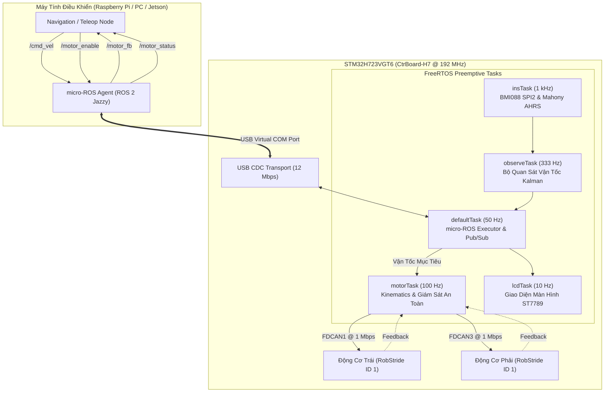

# Bộ Điều Khiển Robot Vi Sai micro-ROS trên STM32H723

[](https://opensource.org/licenses/MIT)
[](https://docs.ros.org/en/jazzy/)
[](https://www.st.com/en/microcontrollers-microprocessors/stm32h723vg.html)

**Tiếng Việt** | [**English**](README.md)

Firmware nhúng hiệu năng cao cho robot di động dẫn động vi sai 2 bánh sử dụng vi điều khiển **STM32H723VGT6** (ARM Cortex-M7 @ 192 MHz). Board đóng vai trò là một **ROS 2 Jazzy node** hoàn chỉnh qua **micro-ROS** giao tiếp bằng **USB CDC Virtual COM Port (12 Mbps)**, điều khiển 2 động cơ **RobStride / CyberGear** qua 2 bus FDCAN độc lập kèm bộ ước lượng tư thế IMU và màn hình hiển thị trực quan.

---

## 🌟 Tính Năng Nổi Bật

- **Tích Hợp ROS 2 Jazzy Trực Tiếp:** Giao tiếp DDS gốc qua micro-ROS trên đường truyền USB CDC ACM tốc độ cao, không cần node trung gian (bridge).
- **Kiến Trúc Dual-Bus FDCAN:** 2 kênh FDCAN1 (Bánh trái) và FDCAN3 (Bánh phải) độc lập chạy ở tốc độ 1 Mbps với điều khiển tổng trở MIT.
- **Đa Nhiệm FreeRTOS Định Thời Chuẩn:** Task IMU 1 kHz, bộ quan sát vận tốc Kalman 333 Hz, vòng lặp điều khiển motor 100 Hz và luồng xuất bản ROS 2 50 Hz.
- **Cơ Chế An Toàn & Tự Phục Hồi:** Tự động ngắt động cơ khi mất tín hiệu điều khiển quá 500 ms (`CMD_VEL_TIMEOUT_MS`), bắt buộc kích hoạt động cơ tường minh qua `/motor_enable`, tự động giải phóng và kết nối lại micro-ROS khi rút/cắm cáp USB.
- **Chẩn Đoán & Đo Lường Trực Tiếp:** Màn hình màu ST7789 (240×280 px) hiển thị thời gian ping RTT, tần số topic và trạng thái bus; cổng UART7 xuất log chẩn đoán chuyên sâu.

---

## 📐 Kiến Trúc Hệ Thống



---

## 📡 Giao Tiếp ROS 2

### Danh Sách Topic

| Tên Topic | Chiều | Kiểu Dữ Liệu | QoS Reliability | Tần Số | Ý Nghĩa |
|---|:---:|---|---|:---:|---|
| [`/cmd_vel`](docs/topics.md#31-cmd_vel-velocity-command) | Sub | `geometry_msgs/msg/Twist` | **Best Effort** | Tối đa 50 Hz | Vận tốc mục tiêu ($v_x\text{ [m/s]}$, $\omega_z\text{ [rad/s]}$) |
| [`/motor_enable`](docs/topics.md#32-motor_enable-motor-state-control) | Sub | `std_msgs/msg/Bool` | **Reliable** | Theo yêu cầu | Bật (`true`) / Tắt (`false`) công suất động cơ |
| [`/motor_fb`](docs/topics.md#33-motor_fb-wheel-odometry--joint-feedback) | Pub | `sensor_msgs/msg/JointState` | **Best Effort** | **50 Hz** | Vị trí góc (rad), vận tốc (rad/s), mô-men (Nm) |
| [`/motor_status`](docs/topics.md#34-motor_status-status-bitmask) | Pub | `std_msgs/msg/UInt8` | **Reliable** | **5 Hz** | Trạng thái lỗi, kết nối CAN và timeout |

### Ý Nghĩa Bitmask `/motor_status`

| Bit | Giá Trị Hex | Tên Cờ | Ý Nghĩa |
|:---:|:---:|---|---|
| 0 | `0x01` | `MSTAT_LEFT_FRESH` | Động cơ trái đang phản hồi dữ liệu bình thường |
| 1 | `0x02` | `MSTAT_RIGHT_FRESH` | Động cơ phải đang phản hồi dữ liệu bình thường |
| 2 | `0x04` | `MSTAT_CAN1_BUSOFF` | Bus FDCAN1 rơi vào trạng thái Bus-Off |
| 3 | `0x08` | `MSTAT_CAN3_BUSOFF` | Bus FDCAN3 rơi vào trạng thái Bus-Off |
| 4 | `0x10` | `MSTAT_MOTORS_ENABLED` | Động cơ đang được cấp nguồn điều khiển (Enabled) |
| 5 | `0x20` | `MSTAT_CMD_TIMEOUT` | Mất tín hiệu điều khiển `/cmd_vel` quá 500 ms |

---

## 🚀 Hướng Dẫn Bắt Đầu Nhanh

### 1. Biên Dịch & Nạp Firmware

```bash
# Clone repository
git clone https://github.com/nguyenbinh-shark/ros_h7_usb.git
cd ros_h7_usb

# Tải thư viện tĩnh micro-ROS dựng sẵn
./tools/fetch_libmicroros.sh

# Biên dịch firmware
make -j$(nproc)

# Nạp qua STM32CubeProgrammer CLI
STM32_Programmer_CLI -c port=SWD mode=UR -w build/microros_H7.bin 0x08000000 -v -rst
```

### 2. Cài Đặt Máy Chủ & Chạy micro-ROS Agent

```bash
# Cài đặt tự động udev rule và systemd service trên máy tính nhúng
cd deploy/
sudo ./install_host.sh

# Hoặc chạy Agent thủ công:
source /opt/ros/jazzy/setup.bash
ros2 run micro_ros_agent micro_ros_agent serial --dev /dev/stm32_robot
```

### 3. Điều Khiển Bằng Bàn Phím (Teleop)

```bash
python3 teleop/teleop_key.py
```
> **⚠️ Lưu ý an toàn:** Động cơ mặc định ở trạng thái **DISABLED** khi mới bật nguồn. Nhấn phím **`e`** trong cửa sổ teleop để bật động cơ trước khi di chuyển bằng `w`/`a`/`s`/`d`.

---

## 📂 Danh Mục Tài Liệu Chi Tiết

Xem các hướng dẫn chuyên sâu trong thư mục [`docs/`](docs/):

- [**Phần Cứng & Sơ Đồ Đấu Dây**](docs/hardware.md) — Danh mục linh kiện BOM, kết nối dual-CAN, trở đầu cuối $120\text{ }\Omega$, bảng chân GPIO.
- [**Hướng Dẫn Build & Flash**](docs/build_flash.md) — Cài đặt toolchain GCC ARM, nạp bằng OpenOCD/STM32Prog, khôi phục Makefile khi CubeMX gen lại code.
- [**Cấu Hình Máy Chủ & ROS 2**](docs/ros_setup.md) — micro-ROS Agent native/Docker, cấu hình dịch vụ systemd, chia sẻ cổng qua WSL2.
- [**Quy Chuẩn Topic ROS**](docs/topics.md) — Định nghĩa chi tiết các thông điệp, phương trình động học vi sai, cấu hình QoS.
- [**Chẩn Đoán & Xử Lý Sự Cố**](docs/troubleshooting.md) — Bảng tra cứu mã lỗi FDCAN LEC và xử lý các lỗi thường gặp.
- [**Tùy Biến Cấu Hình Robot**](docs/porting.md) — Hướng dẫn chỉnh bán kính bánh, khoảng cách bánh và ID động cơ trong `robot_config.h`.
- [**Kiến Trúc Firmware**](docs/development.md) — Chi tiết các tác vụ FreeRTOS, sơ đồ mã nguồn, cấu hình debug VS Code + GDB.
- [**Giao Thức RobStride / CyberGear**](docs/reference/robstride_protocol.md) — Cấu trúc khung truyền 29-bit CAN Extended và tập lệnh động cơ.

---

## 📄 Bản Quyền & Giấy Phép

- Phần mềm nhúng, script triển khai và tài liệu do tác giả viết: [**MIT License**](LICENSE) © 2026 Trần Nguyễn Bình.
- Các thành phần thư viện bên thứ ba (ST HAL, FreeRTOS, CMSIS, micro-ROS, v.v.) được ghi nhận chi tiết tại [**NOTICE.md**](NOTICE.md).

